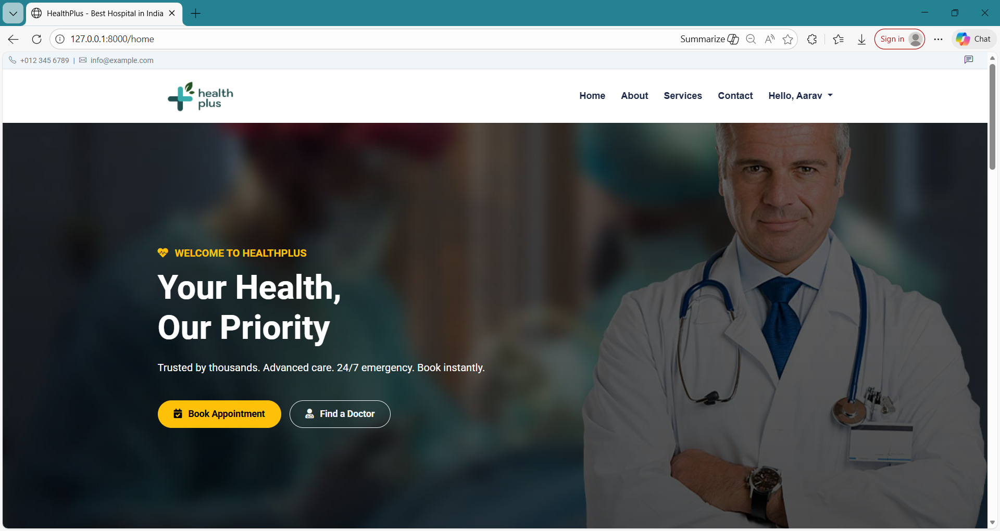
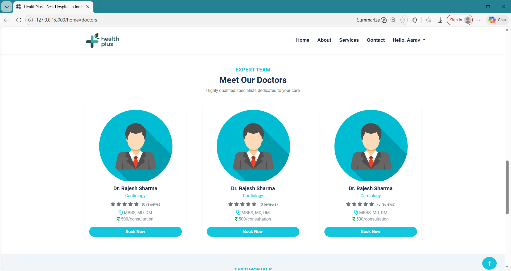
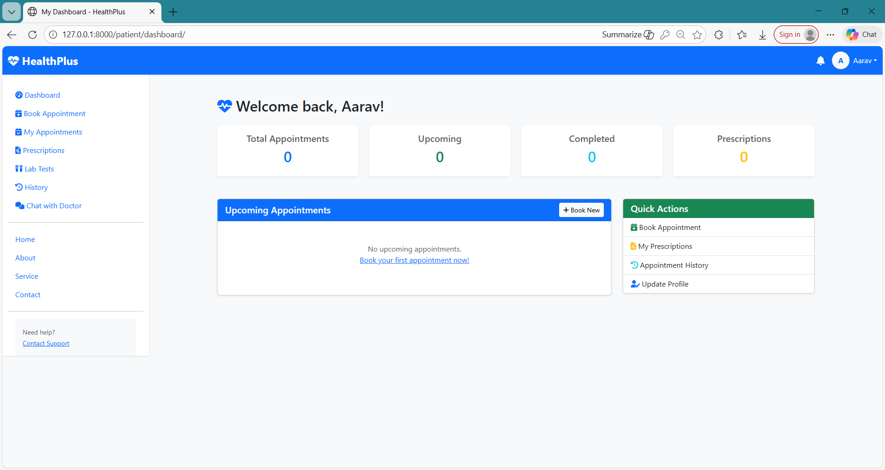
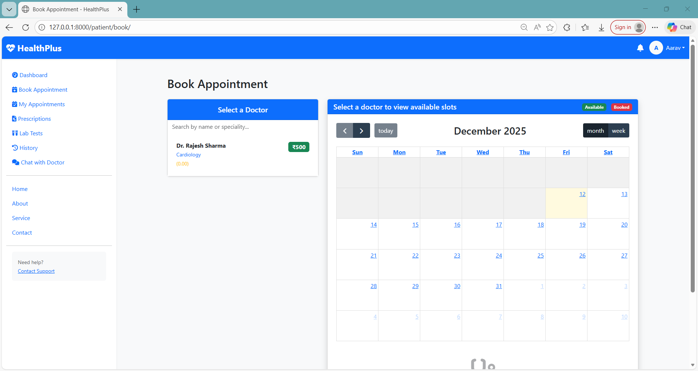
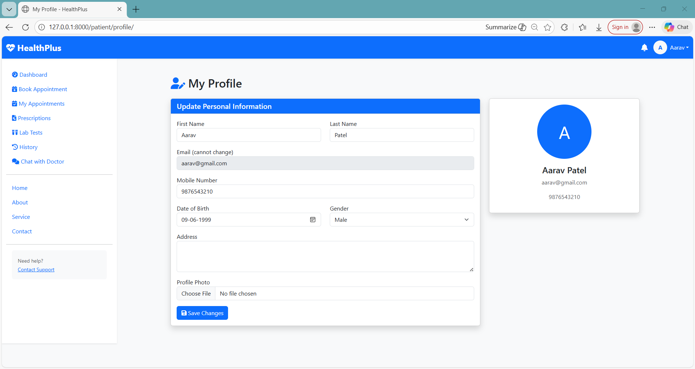
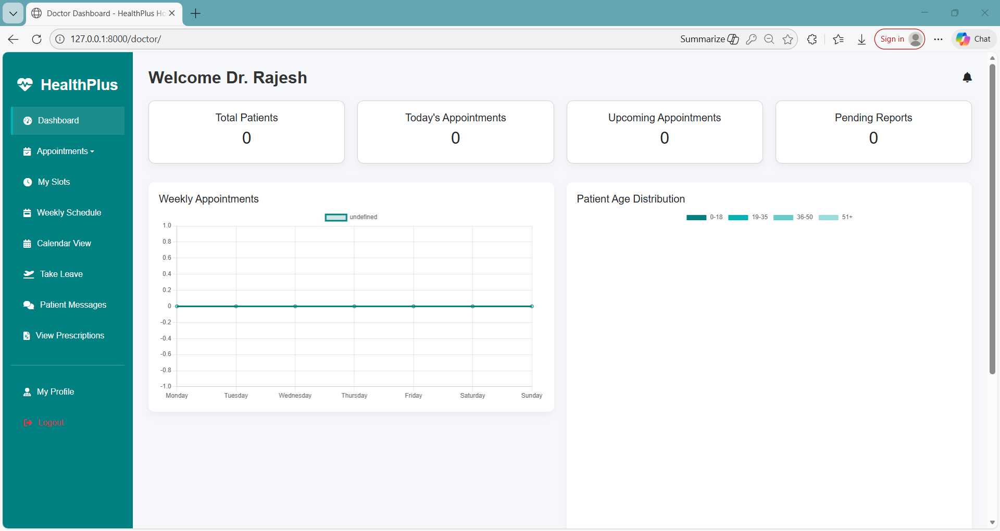
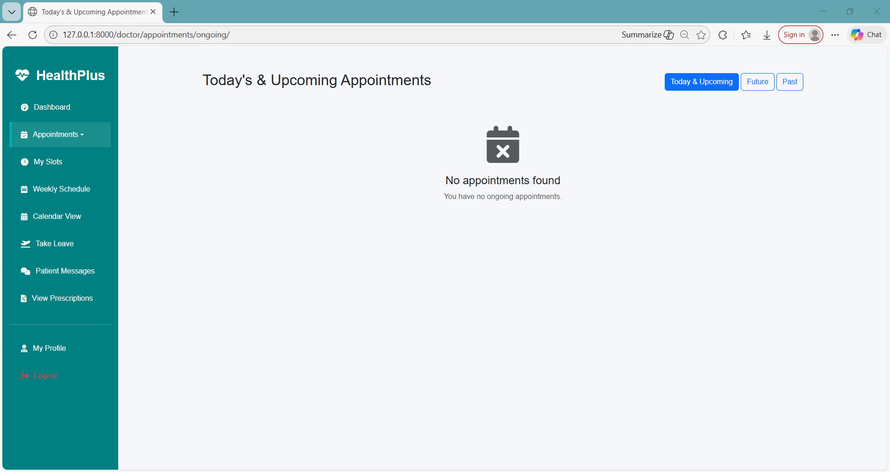
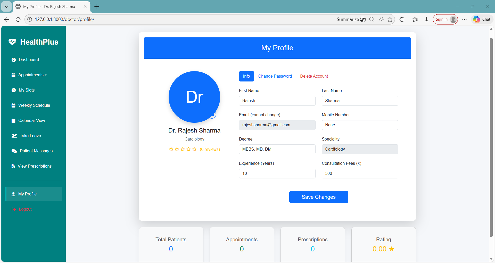
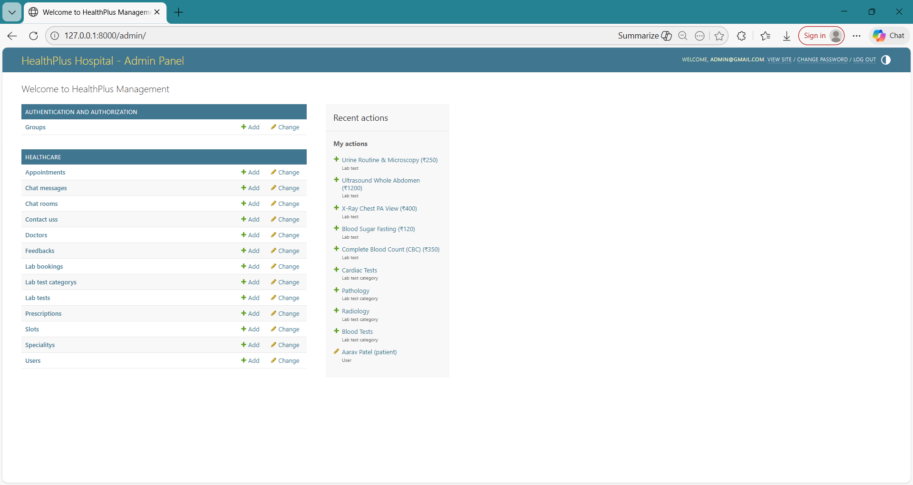
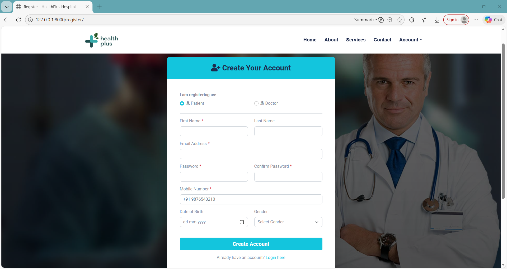

# E HealthCare Management System

E HealthCare Management System is a comprehensive web application designed to streamline the management of healthcare services. It provides functionalities for patients, doctors, and administrators to efficiently handle appointments, medical records, billing, and more.

## Features

- User-friendly interface for patients to book appointments and view.
- Secure login and registration for patients, doctors, and administrators.
- Management of medical records and prescriptions.
- Chat functionality for patients and doctors.
- Patient booked appointment then automatic email notification for verification.
- Patient can view their appointment history.
- Admin dashboard for managing users, appointments, and reports.
- Responsive design for accessibility on various devices.
- Patient can give feedback and suggestions.
- Patient can view doctors' profiles and specialties.
- Patient can cancel or reschedule appointments.
- Patient can book test lab appointments then automatic email notification for verification.

## Technologies Used

- Frontend: HTML, CSS, JavaScript, Bootstrap
- Backend: Django (Python)
- Database: SQLite/PostgreSQL
- Email Service: SMTP for email notifications

## Installation

1.Clone the repository:

```bash
   git clone https://github.com/bilalshaikh-code/e_healthcare_management.git
```

2.Navigate to the project directory:

```bash
   cd e_healthcare_management
```

3.Install the required dependencies:

```bash
   pip install -r requirements.txt
```

4.Apply migrations to set up the database:

```bash
   python manage.py migrate
```

5.Create a superuser for admin access:

```bash
   python manage.py createsuperuser
```

6.Run the development server:

```bash
   python manage.py runserver
```

7.Open your web browser and go to `http://127.0.0.1:8000/` to access the application.

## Usage

- Register as a patient, doctor, or administrator.
- Log in to your account.
- Navigate through the dashboard to access various features.
- Book appointments, view medical records, and manage your profile.

## Sample Users

### 1. Administrator

- Email: [admin@gmail.com]
- Password: same@123

### 2. Doctor

- Email: [rajeshsharma@gmail.com]
- Password: same@123

### 3. Patient

- Email: [aarav@gmail.com]
- Password: same@123

## Screenshots

### Home Page




### Patient Dashboard





### Doctor Dashboard





### Admin Dashboard



### Login and Registration




## Contributing

Contributions are welcome! Please fork the repository and create a pull request with your changes.

## Author

- [GitHub](https://github.com/bilalshaikh-code)
